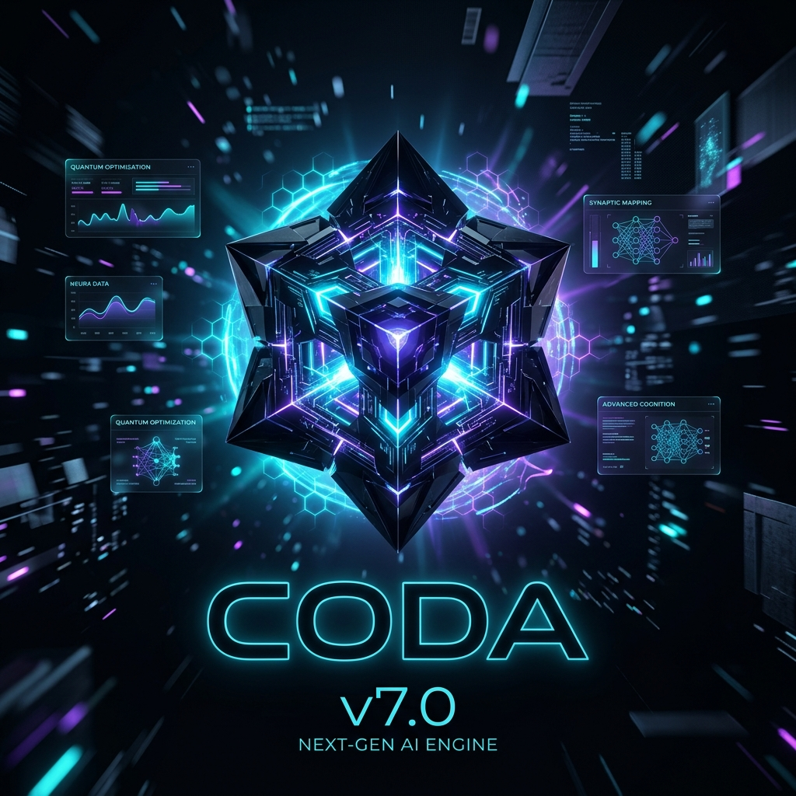
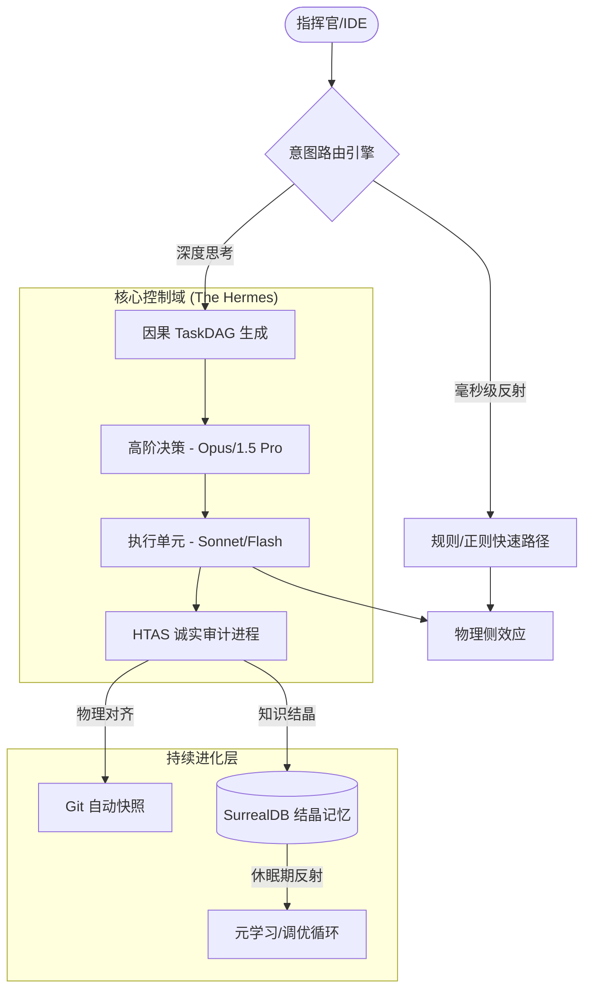

# 🌌 Coda Engine V7.2 — 自主智能代理编排引擎

[English Version](./README_en.md) | [中文说明](./README.md)



<div align="center">

**Coda 是一个面向生产环境的自主 Agent 编排框架，专注于物理审计、长效记忆与自进化能力。**

[](https://www.python.org/)
[](https://surrealdb.com/)
[](https://github.com/psf/black)

[**快速开始**](#-快速上手) • [**核心架构**](#-核心架构) • [**诚实协议**](#-诚实协议-htas) • [**蜂群模式**](#-蜂群主宰)

</div>

---

## ⚡ 项目定位

Coda  是一个旨在解决自主 Agent “不可控”与“低效率”问题的编排引擎。它不仅是 LLM 的调用接口，更是一套集成了物理审计系统、认知图谱数据库与元学习循环的代理基础设施。

**Coda (Hermes)** 是一个面向未来的自主自进化 Agent 核心引擎。它不仅仅是运行大模型的骨架，更是一套集成了 **物理审计、因果推演、元学习能力** 的生产级基础设施。我们不再仅仅依赖提示词工程（Prompt Engineering），而是构建了一个物理级的**控制外骨架**。它让 AI 拥有了长期的“结晶记忆”，并以近乎残酷的**物理审计**方案，确保每一行代码、每一个决策都坚实落地。

不同于传统的对话式 Agent，Coda 采用了 **HTAS (Honest Termination & Anti-Stall)** 协议，确保任务执行的闭环真实性、物理可验证性以及极致的 Token 经济性。

---

## 🚀 3 分钟快速上手

### **1. 环境初始化**

该脚本会自动检测并配置 Git, Python 3.10+, Node.js 与 Docker 等基础环境。

**Windows (PowerShell)**:

```powershell
.\init.ps1
```

**Linux / macOS (Bash)**:

```bash
./init.sh
```

### **2. 启动引擎**

启动脚本会一键拉起本地 SurrealDB 数据库、API 服务及监控后台。

#### **Windows**

```powershell
.\scripts\startup\windows\startup.ps1 -Console -UI
```

#### **Linux**

```bash
./scripts/startup/linux/startup.sh start
```

### **3. 配置密钥**

复制 `.env.template` 为 `.env`，并填入您的 API 密钥（Gemini/Anthropic/OpenAI）。

---

## 💻 IDE 边车模式

Coda 提供了一个兼容 OpenAI 格式的本地代理接口，可作为“侧车（Sidecar）”接入主流 IDE（如 Cursor, VS Code, Windsurf）。

1. **接口地址**: `http://127.0.0.1:11002` (Windows) 或 `http://127.0.0.1:8001` (Linux)
2. **核心逻辑**: Coda 会在后台拦截 IDE 的 LLM 请求，并注入 **联邦知识图谱** 提供的上下文，同时通过 **HTAS 协议** 监控 IDE 对本地文件系统产生的实际修改，确保 Agent 不会在复杂任务中陷入幻觉或死循环。

---

## 🧠 核心架构 (Neural Architecture)



---

## 💎 核心特性

### 🛡️ 诚实协议 HTAS (Honest Termination)

这是 Coda 的核心安全机制。如果 Agent 在连续 3 轮交互中未能产生有效的物理变更（如修改文件、执行命令成功、数据库更新），HTAS 将判定其陷入了“语言循环”并强制终止任务。**我们只验证物理结果，不采信口头承诺。**

### 🔮 联邦结晶记忆

利用 SurrealDB 3.x 构建的认知图谱。记忆被分为**流式（短期上下文）**与**结晶（长期结构化知识）**。只有经过验证的任务路径和技能会被“结晶”存入图谱，大幅提升 RAG 的召回精度。

### 🔋 军师-执行官模式 (Strategist-Executor)

系统默认采用分层计算架构：90% 的执行任务交给高吞吐、低成本模型（如 Gemini Flash），仅在关键决策或逻辑校验点唤醒顶级模型（如 Claude Opus）。这种模式在保持顶尖表现的同时，可降低 80% 的运行成本。

---

## 🛠️ 技术栈

- **Core**: Python 3.12+ (全异步架构, 强类型检查)
- **Database**: SurrealDB 3.x (原生向量图数据库)
- **Control**: PowerShell 7+ (Windows 环境下的进程树管控)
- **Auditing**: 物理 Git 链路快照

---

## 🤝 蜂群主宰 (The Swarm)

- **Commander**: 指挥官。解析意图，拆解全局任务。
- **Coder**: 代码代理。具备自检能力的逻辑输出单元。
- **Verifier**: 审计官。冷酷校验物理侧变动，判定任务收敛。
- **MemoryKeeper**: 记录员。维护联邦知识库与认知图谱。
- **Doctor**: 医生。负责引擎自愈与残留进程清理。

---

## License · 使用授权

- **个人使用：免费、自由**  
  学习、研究、创作、个人项目、写文章、发社交平台，均可自由使用。

- **企业商用：禁止未经授权的使用**  
  任何公司、团队、或以盈利为目的的组织，如需将本引擎或其 Skill 集成到产品、服务或交付给客户，必须先联系 **tqangxl** 获得商业授权。包括但不限于：
  - 作为公司内部工具链的一部分。
  - 作为对外交付物的主要生产手段。
  - 基于此进行二次开发做成商业产品。

---
<div align="right">
Crafted with precision by <b>tqangxl</b> & <b>Coda Team</b>
</div>
