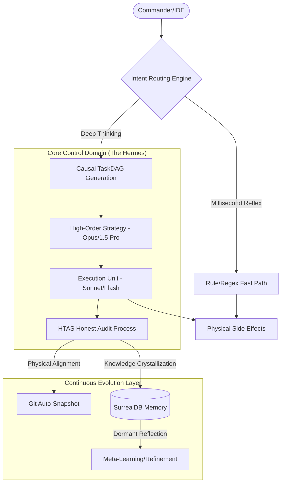

# 🌌 Coda Engine V7.2 — Autonomous Agent Orchestration Framework

[English Version](./README_en.md) | [中文说明](./README.md)


<div align="center">

**Coda is a production-grade autonomous agent orchestration framework focused on physical auditing, long-term memory, and self-evolution.**

[](https://www.python.org/)
[](https://surrealdb.com/)
[](https://github.com/psf/black)

[**Quick Start**](#-quick-start) • [**Architecture**](#-neural-architecture) • [**Honest Protocol**](#-honest-protocol-htas) • [**The Swarm**](#-the-swarm)

</div>

---

## ⚡ Positioning

Coda is an orchestration engine designed to solve the issues of "uncontrollability" and "inefficiency" in autonomous agents. It is not just an LLM interface but a complete agent infrastructure integrating physical auditing, cognitive graph databases, and meta-learning loops.

The core philosophy is **Physical Side-Effect Driven**: We do not judge an agent's progress based on its verbal descriptions; instead, we strictly audit actual physical changes made to the filesystem, database, or external APIs.

---

## 🚀 Quick Start

### **1. Environment Initialization**

The initialization script automatically detects and configures basic environments including Git, Python 3.10+, Node.js, and Docker.

**Windows (PowerShell)**:

```powershell
.\init.ps1
```

**Linux / macOS (Bash)**:

```bash
./init.sh
```

### **2. Start the Engine**

The startup script launches the local SurrealDB database, API services, and the monitoring dashboard.

#### **Windows**

```powershell
.\scripts\startup\windows\startup.ps1 -Console -UI
```

#### **Linux**

```bash
./scripts/startup/linux/startup.sh start
```

### **3. Configure Secrets**

Copy `.env.template` to `.env` and fill in your API keys (Gemini, Anthropic, or OpenAI).

---

## 💻 IDE Sidecar Mode

Coda provides an OpenAI-compatible local proxy interface that can be integrated as a "Sidecar" into major IDEs (e.g., Cursor, VS Code, Windsurf).

1. **API Address**: `http://127.0.0.1:11002` (Windows) or `http://127.0.0.1:8001` (Linux)
2. **Core Logic**: Coda intercepts LLM requests from the IDE and injects context provided by the **Federated Knowledge Graph**. It simultaneously monitors physical modifications via the **HTAS Protocol** to prevent hallucination or infinite loops in complex tasks.

---

## 🧠 Core Architecture (Neural Architecture)



---

## 💎 Key Features

### 🛡️ HTAS Protocol (Honest Termination)

The core safety mechanism of Coda. If an agent fails to produce valid physical changes (e.g., file modifications, successful command executions, database updates) for 3 consecutive turns, HTAS terminates the task or switches strategy. **We verify physical results, not verbal promises.**

### 🔮 Federated Crystallized Memory

A cognitive graph built with SurrealDB 3.x. Memory is divided into **Fluid (short-term context)** and **Crystallized (long-term structured knowledge)**. Only verified task paths and skills are "crystallized" into the graph, significantly improving RAG recall precision.

### 🔋 Strategist-Executor Model

Coda employs a tiered compute architecture by default: 90% of execution tasks are handled by high-throughput, low-cost models (e.g., Gemini Flash), only awakening top-tier models (e.g., Claude Opus) for critical decisions or logical verification. This reduces operational costs by up to 80% while maintaining performance.

---

## 🛠️ Technology Stack

- **Core**: Python 3.12+ (Async architecture, strict typing)
- **Database**: SurrealDB 3.x (Native vector graph database)
- **Control**: PowerShell 7+ (Process tree management on Windows)
- **Auditing**: Physical Git-link snapshots

---

## 🤝 The Swarm

- **Commander**: Strategic lead. Parses intent and decomposes global tasks.
- **Coder**: Tactical output. Logic unit with self-verification capabilities.
- **Verifier**: Professional auditor. Coldly verifies physical changes to judge task convergence.
- **MemoryKeeper**: Archivist. Manages the federated knowledge base and cognitive graph.
- **Doctor**: Field medic. Responsible for self-healing and process cleanup.

---

## License

- **Personal Use: Free & Open**  
  Study, research, creation, personal projects, articles, and social media sharing are all permitted.

- **Commercial Use: Prohibited Without Authorization**  
  Any company, team, or profit-driven organization wishing to integrate this engine or its skills into products, services, or client deliverables must contact **tqangxl** for authorization. This includes:
  - Integration into internal company toolchains.
  - Using outputs as a primary creation method for deliverables.
  - Developing commercial products based on the engine/skills.

---
<div align="right">
Crafted with precision by <b>tqangxl</b> & <b>Coda Team</b>
</div>
